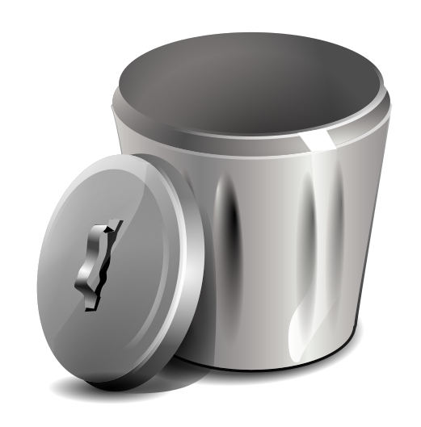

  <h3 align="center">Spamdexing Sites</h3>
  

  

    URL feed for blocking spamdexing websites. Let's banish them to the rubbish bin where they belong!
  

  

  
  
  
  
  

  

  
  
  
  

## What is spamdexing?

[Spamdexing](https://en.wikipedia.org/wiki/Spamdexing) is the deliberate manipulation of search engine indexes. It involves a number of methods, such as link building and repeating unrelated phrases, to manipulate the relevance or prominence of resources indexed, in a manner inconsistent with the purpose of the indexing system.

## Blocklist

| File | Download |
|:-:|:-:|
| blocklist.txt | [:floppy_disk:](blocklist.txt?raw=true) |
| blocklist_ABP.txt | [:floppy_disk:](blocklist_ABP.txt?raw=true) |
| blocklist_UBO.txt | [:floppy_disk:](blocklist_UBO.txt?raw=true) |

## Feedback

Report false positives [here](https://github.com/elliotwutingfeng/SpamdexingSites/issues)
